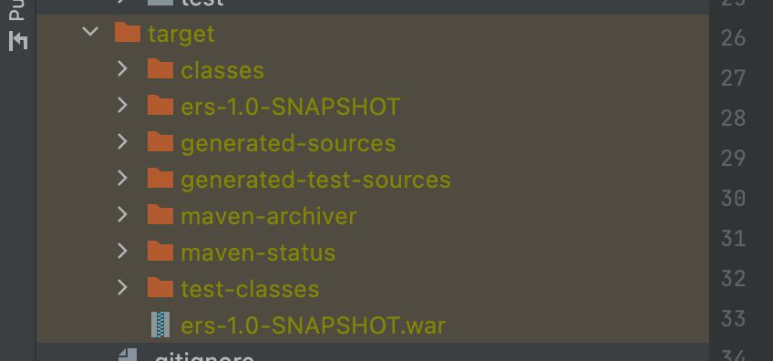
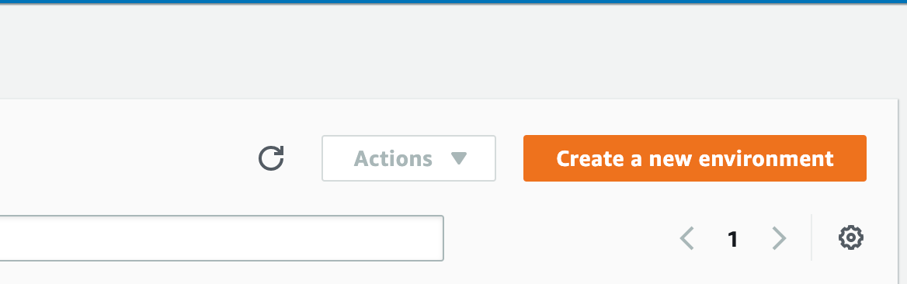
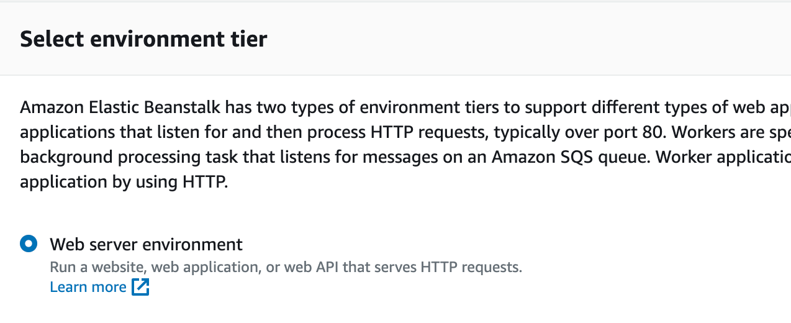
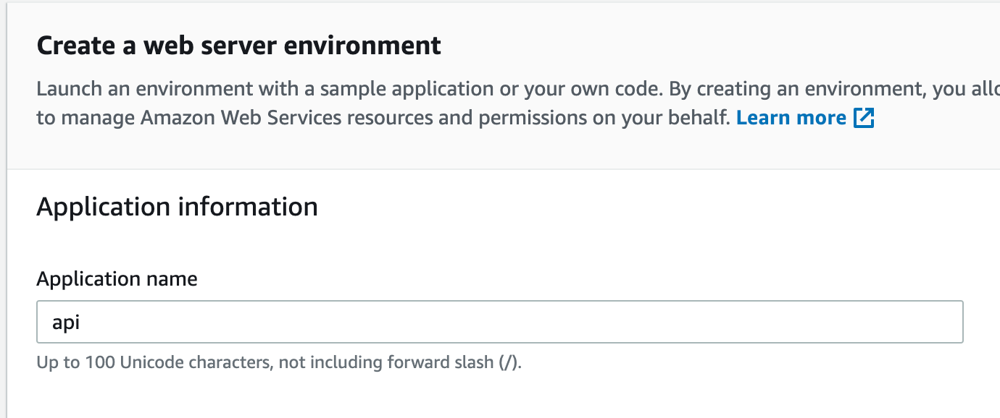
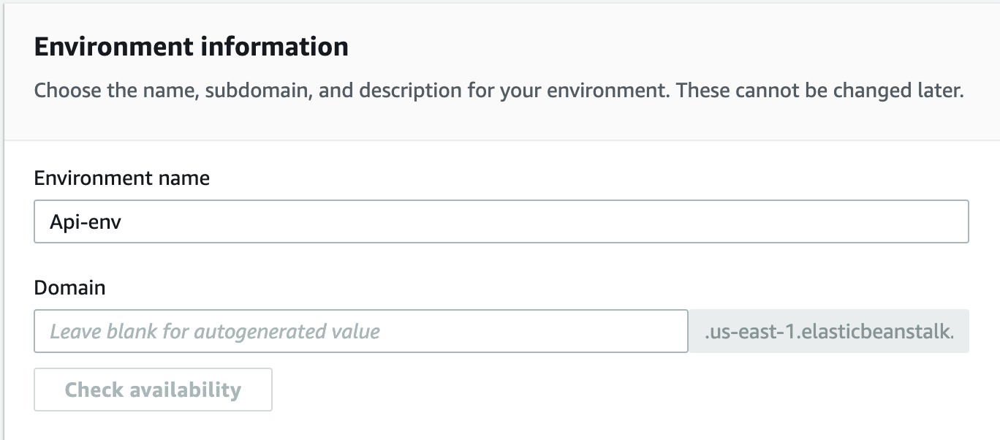
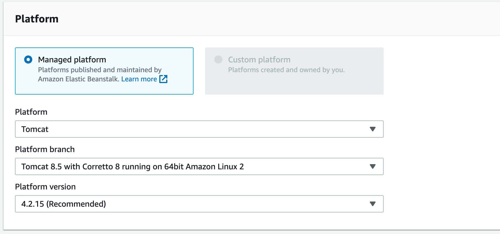
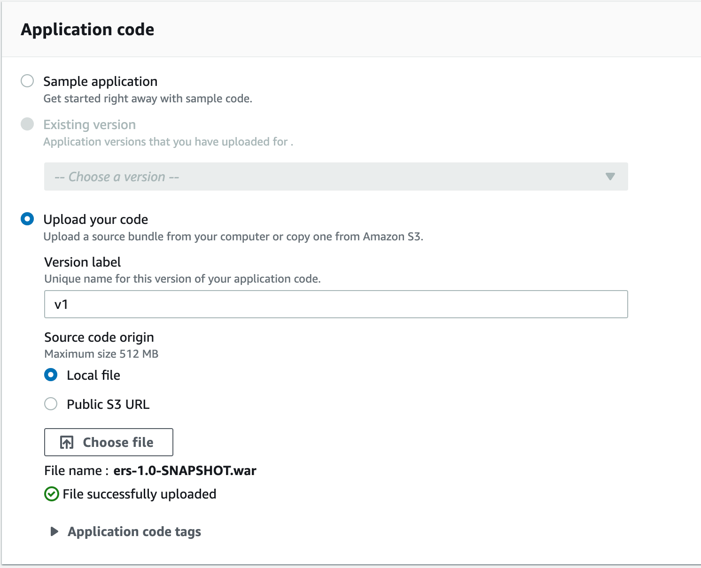
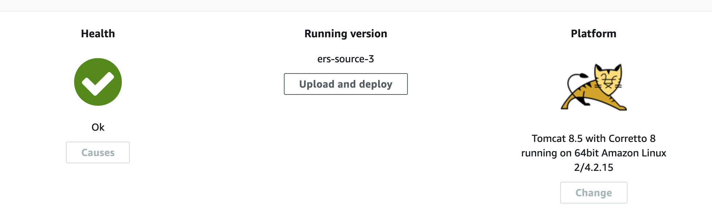

# AWS Beanstalk

## Pre-Req

### AWS Beanstalk

AWS Elastic Beanstalk is an orchestration service offered by Amazon Web Services for deploying applications which
orchestrates various AWS services, including EC2, S3, Simple Notification Service (SNS), CloudWatch, autoscaling,
and Elastic Load Balancers.

## Apache Tomcat 8.5.81

### Pre-Req

#### War File
In software engineering, a WAR file (Web Application Resource or Web application ARchive) is a file used to 
distribute a collection of JAR-files, JavaServer Pages, Java Servlets, Java classes, XML files, tag libraries, 
static web pages (HTML and related files) and other resources that together constitute a web application.

#### Content and structure
A WAR file may be digitally signed in the same way as a JAR file.

The /WEB-INF directory in the WAR file contains a file named web.xml which defines the structure of the web application. 

If the web application uses servlets,then the servlet container uses web.xml to ascertain to which servlet a URL request will be routed. The web.xml file is also used to define 
context variables which can be referenced within the servlets and it is used to define environmental dependencies which the deployer 
is expected to set up. An example of this is a dependency on a mail session used to send email. The servlet container is responsible for providing this service.

##### Location

The War file is located in the target file in your project
directory

### Create New Environment

#### Step 1 Create New Environment

Go to AWS Beanstalk and create a new enviorment

#### Step 2 Select Environment Tier

Select `Web server environment`.

#### Step 3 Create Application Name

Create a name for your application for this demo the name is
`api`

#### Step 4 Environment Info

AWS auto fills an environment name you
can keep it or change it to whatever 
you want.

(Optional) you are also able to specify a
domain name as well

#### Step 5 Platform Info

Select `Tomcat`

Select `Tomcat 8.5 with Coretto 8`
(I tried with 11 but it gave  me fatal)

Select `4.2.15`

#### Step 6 Platform Info

Select `Upload your code`

Fill in `Version Label`

Select `Local file`

Click `Choose file` and select the `war` file you would like to deploy

### Step 7

Click `Create enviorment`

wait till instance is no longer `pending`

